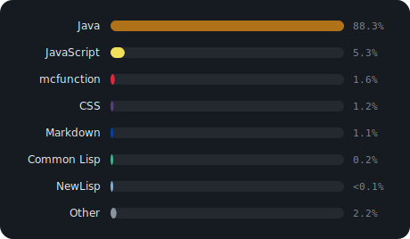

# GitHub Stats — 導入ガイド

GitHub の活動統計（**Activity / 使用言語 / Contributions**）を、複数のチャート形式・自由な色で表示する仕組みです。

**2通りの使い方があります。**

| | HTML ページ | Markdown（.md / README）|
|---|---|---|
| 方式 | ライブウィジェット（JavaScript）| 静的 SVG 画像 |
| 更新 | 閲覧時にその場で取得 | GitHub Action が定期生成 |
| 使うファイル | `charts.js` ＋ `github-stats.js` | `gen-charts.js`（Action）→ `charts/*.svg` |

> Markdown は JavaScript を実行できないため、チャートは**画像（SVG）**として用意します。

---

## 表示できるチャート

| セクション | 指標 | 選べる種類 |
|---|---|---|
| **Activity** | コミット / プルリク / Issue / レビュー / リポジトリ / 関わったPR | `radar` `pie` `bar` `hbar` `area` |
| **使用言語** | リポジトリの言語別バイト数 | `hbar` `pie` `bar` `area` |
| **Contributions** | 日別のコミット数（過去1年）| `grid`（草グラフ）/ `bars3d`（立体棒）|

- 集計期間は既定で**過去1年間**、organization での活動も含む
- 色はすべて変更可能

---

# A. HTML ページでの使い方

## 導入手順

1. `src/js/charts.js` と `src/js/github-stats.js` をコピー
2. スクリプトを読み込む（**charts.js が先**）
3. 表示したい場所に `<div>` を置く

```html
<script src="charts.js"></script>
<script src="github-stats.js"></script>

<div data-github-user="ユーザー名"></div>
```

これだけで、ページ表示時に自動でデータを取得して描画します（CSS も自動注入）。

## 設定オプション（data 属性）

| 属性 | 既定 | 説明 |
|---|---|---|
| `data-github-user` | （必須）| GitHub ユーザー名 |
| `data-accent` | `#7c6af7` | アクセント色 |
| `data-period-days` | `365` | 集計期間（日数）|
| `data-github-orgs` | （自動）| 非公開メンバーの org を手動追加（カンマ区切り）|
| **Activity** | | |
| `data-activity-chart` | `radar` | `radar` `pie` `bar` `hbar` `area` |
| `data-activity-color` | アクセント色 | Activity チャートの色 |
| **使用言語** | | |
| `data-lang-chart` | `hbar` | `hbar` `pie` `bar` `area` |
| `data-lang-color` | 言語ごとの色 | 単色を指定したい場合のみ |
| `data-lang-other` | `1` | この%未満を「Other」に集約。`0` で集約しない |
| `data-lang-pin` | — | %が低くても個別表示する言語（カンマ区切り）|
| `data-lang-exclude` | — | グラフに含めない言語（カンマ区切り）|
| **Contributions** | | |
| `data-contrib-chart` | `grid` | `grid`（草グラフ）/ `bars3d`（立体棒）|
| `data-grass-color` | `#39d353` | 草グラフ・立体棒の色 |

## 記述例

```html
<!-- シンプル -->
<div data-github-user="hrmcngs"></div>

<!-- フル指定 -->
<div data-github-user="hrmcngs"
     data-accent="#3ecfcf"
     data-activity-chart="area"   data-activity-color="#febc2e"
     data-lang-chart="pie"        data-lang-other="2"
     data-lang-exclude="JSON,YAML"
     data-contrib-chart="bars3d"  data-grass-color="#f87171"
     data-period-days="730"></div>
```

---

# B. Markdown での使い方

`.md` では JavaScript が動かないので、チャートを **SVG 画像**として用意し、画像として埋め込みます。

## 仕組み

```
GitHub Action（定期実行）
  └ gen-charts.js が GitHub からデータ取得
      └ charts.js で SVG を描画
          └ charts/*.svg に書き出してコミット
              └ .md が  で表示
```

## 導入手順

1. `scripts/gen-charts.js`・`src/js/charts.js`・`.github/workflows/update-charts.yml` をリポジトリに置く
2. リポジトリの **Settings → Actions → General → Workflow permissions** を「Read and write」にする
3. Actions タブから `Update chart SVGs` を手動実行（または12時間ごとに自動実行）
4. `charts/` に SVG が生成される

## Markdown に埋め込む

```markdown



```

他リポジトリの README からは raw URL で:

```markdown

```

## 設定（種類・色）

[`scripts/gen-charts.js`](scripts/gen-charts.js) の `CONFIG` を編集します。**これが Markdown 側のチャート設定**です。

```js
const CONFIG = {
  user: 'hrmcngs',
  orgs: [],
  periodDays: 365,
  outDir: 'charts',
  charts: [
    { file: 'activity.svg',      section: 'activity',      type: 'radar',  color: '#7c6af7' },
    { file: 'languages.svg',     section: 'languages',     type: 'hbar',   other: 1 },
    { file: 'contributions.svg', section: 'contributions', type: 'bars3d', color: '#39d353' },
  ],
};
```

- `type` を変える → チャートの種類が変わる
- `color` を変える → 色が変わる
- `charts` に項目を足す → 別の種類の SVG も同時生成（例: `activity.svg` と `activity-pie.svg` の両方）
- 言語チャートは `exclude` / `pin` / `other` も指定可

編集して Action を再実行すれば、新しい SVG が反映されます。

---

## チャート種類の早見表

| 種類 | 見た目 | 向いている用途 |
|---|---|---|
| `radar` | 多角形のレーダー | 複数指標のバランス（Activity）|
| `pie` | ドーナツ＋凡例 | 構成比（使用言語など）|
| `bar` | 縦棒 | 値の比較 |
| `hbar` | 横棒 | ラベルが長いとき・項目が多いとき |
| `area` | 面（山型）| 推移・分布の雰囲気 |
| `grid` | 草グラフ（GitHub風）| 日別の貢献 |
| `bars3d` | 立体棒 | 日別の貢献を立体で（高さ＝コミット数）|

---

## 仕組み・使用 API

すべて**認証不要・CORS 対応**の API を使います。

| 用途 | API |
|---|---|
| ユーザー・リポジトリ・言語・活動件数 | GitHub REST API（`api.github.com`）|
| Contributions（草データ）| jogruber API（`github-contributions-api.jogruber.de`）|

- HTML 版はブラウザから直接取得（天気ウィジェットと同じ方式）
- Markdown 版は GitHub Action（Node）が取得 → SVG 化
- `charts.js` は SVG 描画を担う共有ライブラリで、ブラウザと Node の両方で動く

## レート制限

GitHub の**未認証** API はアクセス元 IP ごとに制限があります（Core 60回/時、Search 10回/分）。

- HTML 版: 結果を localStorage に **6時間キャッシュ**して負荷を抑える
- Markdown 版（Action）: `GITHUB_TOKEN` を使うので実質制限なし

## トラブルシューティング

| 症状 | 対処 |
|---|---|
| 何も表示されない | F12 → Console / Network を確認。`charts.js` を読み込んでいるか |
| 古い内容のまま | localStorage キャッシュ。`CACHE_VERSION` を上げる／ブラウザのデータを消す |
| `API rate limit exceeded` | 未認証の制限超過。時間を置く |
| Action がコミットしない | Workflow permissions が「Read and write」か確認 |
| organization が出ない | メンバーシップが非公開 → `data-github-orgs` / `CONFIG.orgs` で明示指定 |

---

## ファイル一覧

| ファイル | 役割 |
|---|---|
| `src/js/charts.js` | SVG チャート描画ライブラリ（HTML・Markdown 共用）|
| `src/js/github-stats.js` | HTML 用ライブウィジェット |
| `scripts/gen-charts.js` | Markdown 用 SVG 生成スクリプト（Action から実行）|
| `.github/workflows/update-charts.yml` | SVG を定期生成・コミットする GitHub Action |
| `charts/*.svg` | 生成された SVG（Markdown に埋め込む）|
