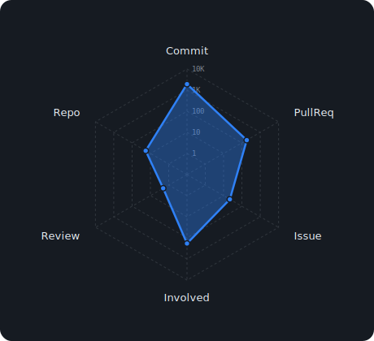
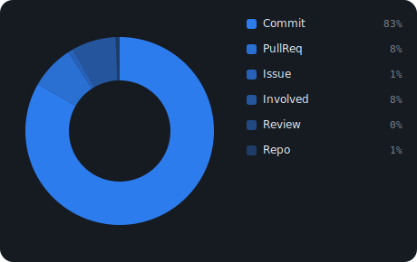
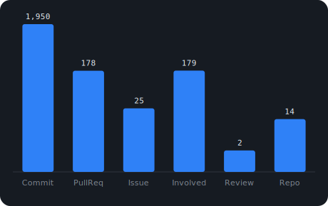
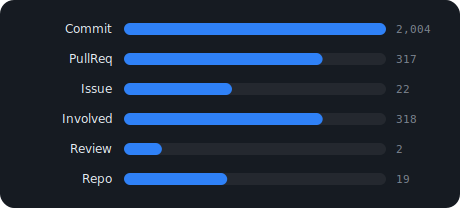
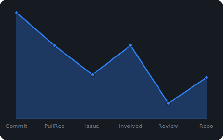
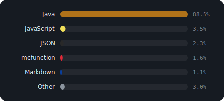
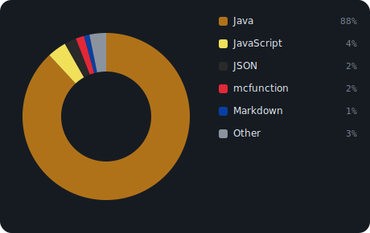
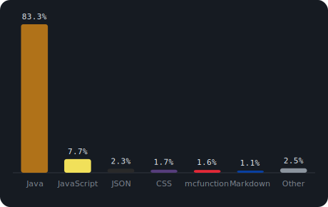
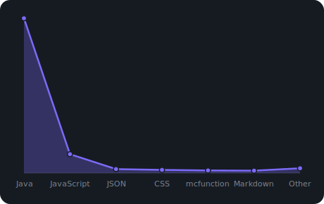
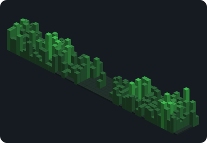

# Sample — GitHub Stats 見本 ＆ 全設定

GitHub 統計ウィジェット（Activity / 使用言語 / Contributions）の**全チャート見本**と**全設定**をまとめたページです。
画像は GitHub Action が自動生成した SVG（[`charts/`](charts/)）。

---

## 使い方は2通り

| | HTML ページ | Markdown / README |
|---|---|---|
| 方式 | ライブウィジェット（JS）| 静的 SVG 画像 |
| 更新 | 閲覧時に取得（失敗時は保存データ）| Action が定期生成 |
| 使うファイル | `charts.js` ＋ `github-stats.js` | `gen-charts.js`（Action）→ `charts/*.svg` |
| 設定の場所 | `<div>` の `data-*` 属性 | `gen-charts.js` の `CONFIG` |

> Markdown は JavaScript を実行できないため、チャートは画像（SVG）で埋め込みます。

---

## 導入：HTML

1. `src/js/charts.js` と `src/js/github-stats.js` をコピー
2. スクリプトを読み込む（**charts.js が先**）
3. 表示したい場所に `<div>` を置く

```html
<script src="charts.js"></script>
<script src="github-stats.js"></script>

<div data-github-user="ユーザー名"></div>
```

CSS は自動で注入されます。`data-*` 属性を足すと種類・色などを変えられます（後述）。

## 導入：Markdown

1. `scripts/gen-charts.js`・`src/js/charts.js`・`.github/workflows/update-charts.yml` を置く
2. Settings → Actions → General → Workflow permissions を「Read and write」に
3. Actions タブで `Update chart SVGs` を実行（または12時間ごとに自動）
4. `charts/` に SVG が生成される → `.md` に画像で埋め込む

```markdown

```

他リポジトリの README からは raw URL で:

```markdown

```

---

## 全チャート見本

### Activity（活動統計）

コミット / プルリク / Issue / レビュー / リポジトリ / 関わったPR の6指標。

#### radar（レーダー）



```markdown

```

```html
<div data-github-user="hrmcngs" data-activity-chart="radar"></div>
```

#### pie（円グラフ）



```markdown

```

```html
<div data-github-user="hrmcngs" data-activity-chart="pie"></div>
```

#### bar（縦棒グラフ）



```markdown

```

```html
<div data-github-user="hrmcngs" data-activity-chart="bar"></div>
```

#### hbar（横棒グラフ）



```markdown

```

```html
<div data-github-user="hrmcngs" data-activity-chart="hbar"></div>
```

#### area（面グラフ）



```markdown

```

```html
<div data-github-user="hrmcngs" data-activity-chart="area"></div>
```

### 使用言語

リポジトリの言語別バイト数。1%未満は自動で Other にまとめます。

#### hbar（横棒グラフ）



```markdown

```

```html
<div data-github-user="hrmcngs" data-lang-chart="hbar"></div>
```

#### pie（円グラフ）



```markdown

```

```html
<div data-github-user="hrmcngs" data-lang-chart="pie"></div>
```

#### bar（縦棒グラフ）



```markdown

```

```html
<div data-github-user="hrmcngs" data-lang-chart="bar"></div>
```

#### area（面グラフ）



```markdown

```

```html
<div data-github-user="hrmcngs" data-lang-chart="area"></div>
```

### Contributions（草グラフ）

#### bars3d（立体棒）

棒の高さ＝コミット数。



```markdown

```

```html
<div data-github-user="hrmcngs" data-contrib-chart="bars3d"></div>
```

#### grid（マス目の草グラフ）※HTMLのみ

GitHub と同じマス目状の草グラフ。Markdown では未対応（HTMLウィジェット専用）。

```html
<div data-github-user="hrmcngs" data-contrib-chart="grid"></div>
```

#### default（季節で自動配色）※HTMLのみ・既定

`data-contrib-chart` を省略するとこれ。GitHub と同様、時期で色が自動で変わります。

| 時期 | 色 |
|---|---|
| ハロウィン（10/24〜31）| 🎃 かぼちゃ色 |
| クリスマス（12/20〜28）| 🎄 赤 |
| その他 | 🟩 緑 |

```html
<div data-github-user="hrmcngs" data-contrib-chart="default"></div>
```

---

## 設定一覧：HTML（`data-*` 属性）

`<div>` に付けます。`data-github-user` 以外はすべて任意。

### 共通

| 属性 | 既定 | 説明 |
|---|---|---|
| `data-github-user` | （必須）| GitHub ユーザー名 |
| `data-accent` | `#2f81f7` | アクセント色 |
| `data-period-days` | `365` | 集計期間（日数）|
| `data-github-orgs` | （自動）| 非公開メンバーの org を手動追加（カンマ区切り）|

### Activity

| 属性 | 既定 | 説明 |
|---|---|---|
| `data-activity-chart` | `radar` | `radar` `pie` `bar` `hbar` `area` |
| `data-activity-color` | アクセント色 | チャートの色 |

### 使用言語

| 属性 | 既定 | 説明 |
|---|---|---|
| `data-lang-chart` | `hbar` | `hbar` `pie` `bar` `area` |
| `data-lang-color` | 言語ごとの色 | 単色を指定したい場合のみ |
| `data-lang-other` | `1` | この%未満を Other に集約。`0` で集約しない |
| `data-lang-pin` | — | %が低くても個別表示する言語（カンマ区切り）|
| `data-lang-merge` | — | %に関わらず Other にまとめる言語 |
| `data-lang-exclude` | — | グラフに含めない言語（集計対象外）|

### Contributions

| 属性 | 既定 | 説明 |
|---|---|---|
| `data-contrib-chart` | `default` | `default`（季節色）/ `grid`（固定色）/ `bars3d`（立体棒）|
| `data-grass-color` | `#39d353` | 草グラフ・立体棒の色（`grid` / `bars3d` 用）|
| `data-contrib-halloween` | `#fa7a18` | `default` 時のハロウィン色 |
| `data-contrib-xmas` | `#e5484d` | `default` 時のクリスマス色 |

### フル指定の例

```html
<div data-github-user="hrmcngs"
     data-accent="#2f81f7"
     data-period-days="365"
     data-activity-chart="radar"   data-activity-color="#febc2e"
     data-lang-chart="pie"         data-lang-color="#3ecfcf"
     data-lang-other="1"           data-lang-pin="Common Lisp,NewLisp"
     data-lang-merge="JSON"        data-lang-exclude="YAML"
     data-contrib-chart="default"  data-grass-color="#39d353"></div>
```

---

## 設定一覧：Markdown（`gen-charts.js` の CONFIG）

[`scripts/gen-charts.js`](scripts/gen-charts.js) の先頭の `CONFIG` を編集します。

```js
const CONFIG = {
  user: 'hrmcngs',      // GitHub ユーザー名
  orgs: [],             // 追加 org（公開メンバーは自動）
  periodDays: 365,      // 集計期間（日数）
  outDir: 'charts',     // SVG の出力先

  // 生成する SVG のリスト。1項目 = 1ファイル。
  charts: [
    { file: 'activity.svg',  section: 'activity',  type: 'radar', color: '#2f81f7' },
    { file: 'languages.svg', section: 'languages', type: 'hbar',  other: 1 },
    { file: 'contributions.svg', section: 'contributions', type: 'bars3d', color: '#39d353' },
  ],
};
```

`charts[]` の各項目で指定できるもの:

| キー | 説明 |
|---|---|
| `file` | 出力ファイル名（`charts/` 内）|
| `section` | `activity` / `languages` / `contributions` |
| `type` | チャート種類（HTMLの `data-*-chart` と同じ）|
| `color` | チャートの色 |
| `other` | （languages）Other 集約の閾値% |
| `pin` / `merge` / `exclude` | （languages）言語の振り分け（配列）|

項目を増やせば別の種類・色の SVG も同時生成できます（例: `activity-pie.svg` を追加）。

---

## 色のカスタマイズ

すべてのチャートは色を変えられます。

- **HTML** … `data-accent` / `data-activity-color` / `data-lang-color` / `data-grass-color` ほか
- **Markdown** … `gen-charts.js` CONFIG の各 `color`

```html
<div data-github-user="hrmcngs"
     data-accent="#2f81f7"
     data-activity-color="#febc2e"
     data-lang-color="#3ecfcf"
     data-grass-color="#39d353"></div>
```

---

## 言語の Other 制御

使用言語チャートで、どの言語を個別表示／Otherにまとめるかを制御できます。

```html
<div data-github-user="hrmcngs"
     data-lang-other="1"
     data-lang-pin="Common Lisp,NewLisp"
     data-lang-merge="JSON"
     data-lang-exclude="YAML"></div>
```

| 属性 | 動作 |
|---|---|
| `data-lang-other` | この%未満を Other に集約（既定 1・`0`で無効）|
| `data-lang-pin` | %が低くても個別表示 |
| `data-lang-merge` | %に関わらず Other へ |
| `data-lang-exclude` | 集計から完全に除外 |

優先順位は **exclude → pin → merge → 閾値**。言語名は大文字小文字を区別しません。

---

## レート制限とフォールバック

GitHub の未認証 API はアクセス元IPごとに制限があります（Core 60回/時・Search 10回/分）。

- **HTML** … 結果を localStorage に6時間キャッシュ。live 取得に失敗したら `charts/data.json`（Action 生成）へ自動フォールバックするので表示は壊れません。
- **Markdown（Action）** … `GITHUB_TOKEN` 使用で 5000回/時 → 実質制限なし。

---

## ファイル一覧

| ファイル | 役割 |
|---|---|
| `src/js/charts.js` | SVG チャート描画ライブラリ（HTML・Markdown 共用）|
| `src/js/github-stats.js` | HTML 用ライブウィジェット |
| `scripts/gen-charts.js` | Markdown 用 SVG 生成スクリプト |
| `.github/workflows/update-charts.yml` | SVG を定期生成・コミットする GitHub Action |
| `charts/*.svg` | 生成された SVG（Markdown に埋め込む）|
| `charts/data.json` | HTML のフォールバック用データ |
